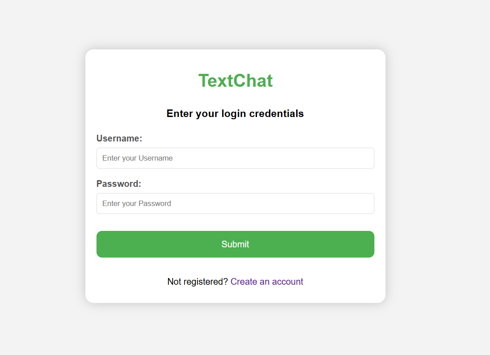
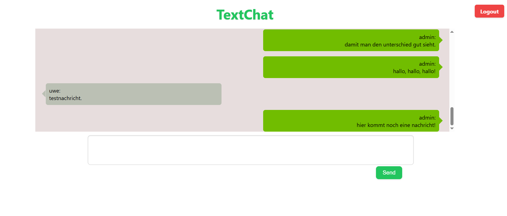

# 🗨️ Simple PHP + JavaScript Chatroom

This is a lightweight web-based chatroom built from scratch using vanilla JavaScript, PHP, and a MySQL database. It was designed as a full-stack portfolio project to demonstrate practical knowledge of user authentication, client-server communication, and asynchronous data handling with JSON.

## 🔧 Features

- ✅ User registration and login system (with basic session handling)
- 💬 Chat messages are stored persistently in a MySQL database
- 📡 JavaScript fetch-based communication with a PHP backend
- 🎨 Simple, clean frontend with vanilla HTML/CSS

## 📁 Technologies Used

- **Frontend:** HTML5, CSS3, JavaScript (no frameworks)
- **Backend:** PHP (pure, no frameworks)
- **Database:** MySQL
- **Communication:** JSON via `fetch()` and polling

